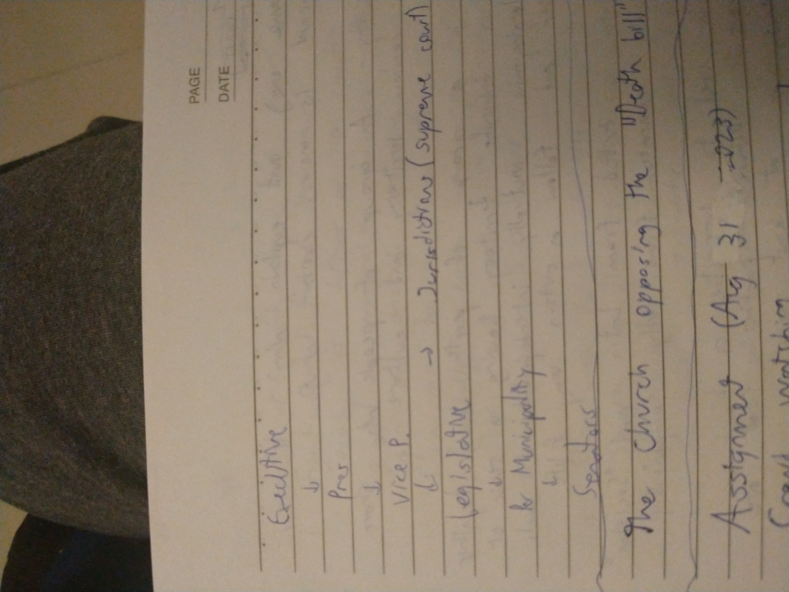

# Political Positions/Candidates
Information updated on 11/3/2023

# Positions

## Presidents in the Philippines
https://en.m.wikipedia.org/wiki/List_of_presidents_of_the_Philippines
The President of the **Philippines** has **17** presidents starting from January 23 1899, starting with **Emilio Aguinaldo** with **no vice president** on the [First Republic Era](https://en.m.wikipedia.org/wiki/First_Philippine_Republic) 

The first president lasted for 2 years and 59 days. (March 23 1901)

Time span was not 6 years, some lasted more than a decade or two. But currently it had the span of **6** years.

There was a vice president starting in the year **1935** naming **Sergio Osmeña** under the [commonwealth](https://en.m.wikipedia.org/wiki/Commonwealth_of_the_Philippines) era.
### There are unofficial presidents too
**Andrés Bonifacio** is considered by some historians to be the first president of the Philippines. He was the third Supreme President (Spanish: Presidente Supremo; Tagalog: Kataastaasang Pangulo) of the Katipunan secret society. Its Supreme Council, led by the Supreme President, coordinated provincial and district councils. When the Katipunan went into open revolt in August 1896 (the Cry of Balintawak), Bonifacio transformed it into a revolutionary government with him as president. 

> [!NOTE] AI generated summary
Andrés Bonifacio was a Filipino revolutionary leader and is often referred to as "The Father of the Philippine Revolution" ¹². He was the third Supreme President of the Katipunan secret society, which coordinated provincial and district councils ¹. When the Katipunan went into open revolt in August 1896 (the Cry of Balintawak), Bonifacio transformed it into a revolutionary government with him as president ¹. While the term Katipunan remained, Bonifacio's government was also known as the Tagalog Republic (Tagalog: Republika ng Katagalugan; Spanish: Republica Tagala) ¹. Although the word Tagalog refers to a specific ethnicity, Bonifacio used it to denote all indigenous people in the Philippines in place of Filipino which had colonial origins ¹. Some historians consider him to be the first president of the Philippines ¹.
¹: [Wikipedia](https://en.wikipedia.org/wiki/Andr%C3%A9s_Bonifacio)
²: [Britannica](https://www.britannica.com/biography/Andres-Bonifacio)
**Source:** Conversation with Bing, 11/3/2023
(1) Andrés Bonifacio - Wikipedia. https://en.wikipedia.org/wiki/Andr%C3%A9s_Bonifacio.
(2) Andrés Bonifacio - Wikipedia, ang malayang ensiklopedya. https://tl.wikipedia.org/wiki/Andr%C3%A9s_Bonifacio.
(3) Andres Bonifacio | Revolutionary, Propagandist, Katipunan. https://www.britannica.com/biography/Andres-Bonifacio.
